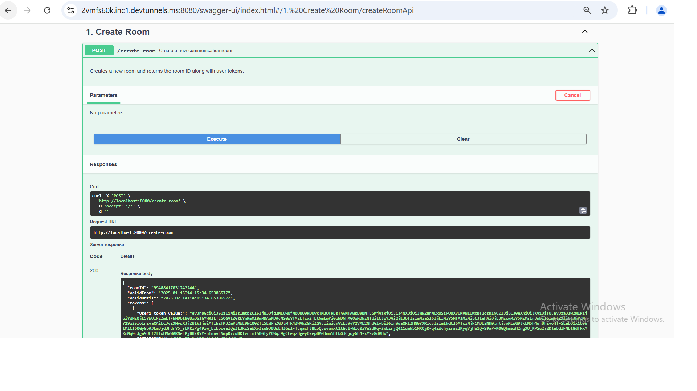
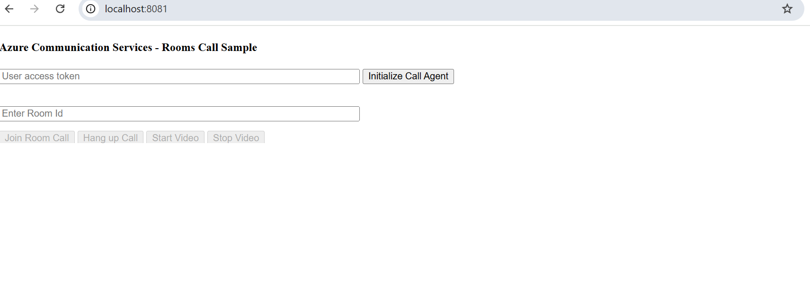
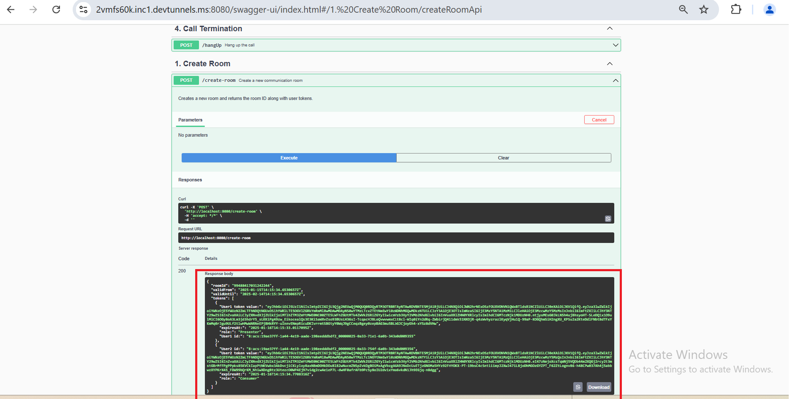
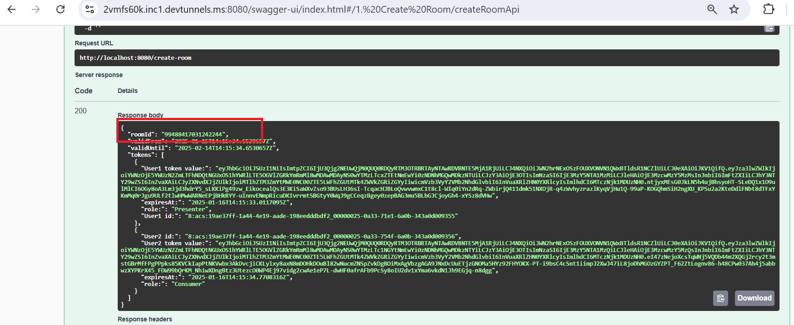
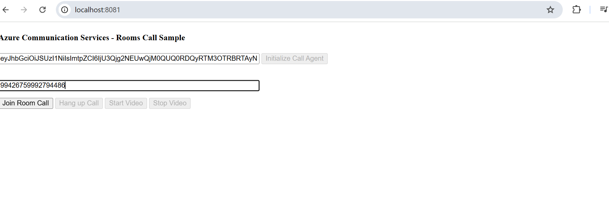
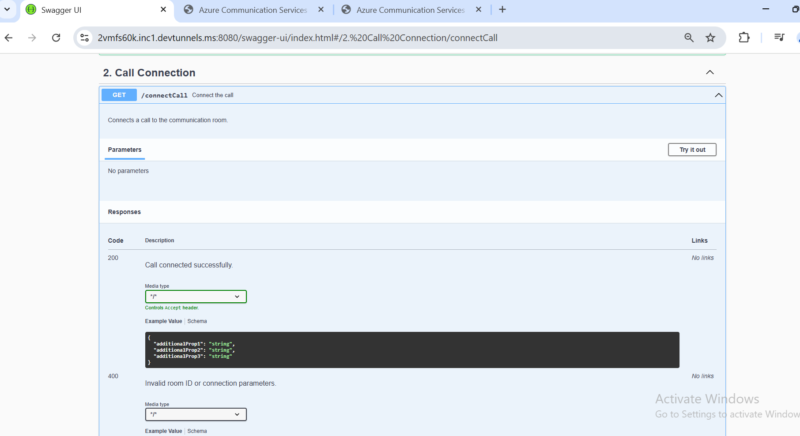

|page_type| languages                             |products
|---|---------------------------------------|---|
|sample| <table><tr><td>Java</tr></td></table> |<table><tr><td>azure</td><td>azure-communication-services</td></tr></table>|

# Call Automation - Quick Start Sample

In this quickstart, we cover how you can use Call Automation SDK to connect to active room call with connect endpoint. Creating room with users and enabling pstn dialout to add pstn participant.
Creating room call with room id. 

## Prerequisites

- An Azure account with an active subscription. [Create an account for free](https://azure.microsoft.com/free/?WT.mc_id=A261C142F). 
- A deployed Communication Services resource. [Create a Communication Services resource](https://docs.microsoft.com/azure/communication-services/quickstarts/create-communication-resource).
- A [phone number](https://learn.microsoft.com/en-us/azure/communication-services/quickstarts/telephony/get-phone-number) in your Azure Communication Services resource that can make outbound calls. NB: phone numbers are not available in free subscriptions.
- Create Azure AI Multi Service resource. For details, see [Create an Azure AI Multi service](https://learn.microsoft.com/en-us/azure/cognitive-services/cognitive-services-apis-create-account).
- [Java Development Kit (JDK) Microsoft.OpenJDK.17](https://learn.microsoft.com/en-us/java/openjdk/download)
- [Apache Maven](https://maven.apache.org/download.cgi)
- Create and host a Azure Dev Tunnel. Instructions [here](https://learn.microsoft.com/en-us/azure/developer/dev-tunnels/get-started)
- To know about rooms see https://learn.microsoft.com/en-us/azure/communication-services/concepts/rooms/room-concept
- To join room call see https://learn.microsoft.com/en-us/azure/communication-services/quickstarts/rooms/join-rooms-call?pivots=platform-web

## Before running the sample for the first time

1. Open an instance of PowerShell, Windows Terminal, Command Prompt or equivalent and navigate to the directory that you would like to clone the sample to.
2. git clone `https://github.com/Azure-Samples/communication-services-java-quickstarts.git`.
3. cd into the `CallAutomation-Connect-Room` folder.
4. From the root of the above folder, and with node installed, run `mvn clean package`

## Before running calling rooms quickstart
1. To initiate rooms call with room id https://github.com/Azure-Samples/communication-services-javascript-quickstarts/tree/main/calling-rooms-quickstart
2. cd into the `calling-rooms-quickstart` folder.
3. From the root of the above folder, and with node installed, run `npm install`
4. to run sample `npx webpack serve --config webpack.config.js`

### Setup and host your Azure DevTunnel

[Azure DevTunnels](https://learn.microsoft.com/en-us/azure/developer/dev-tunnels/get-started?tabs=windows) is an Azure service that enables you to share local web services hosted on the internet. Use the commands below to connect your local development environment to the public internet. This creates a tunnel with a persistent endpoint URL and which allows anonymous access. We will then use this endpoint to notify your application of calling events from the ACS Call Automation service.

```bash
devtunnel create --allow-anonymous
devtunnel port create -p 8080
devtunnel host
```

### Configuring application

- Open the application.yml file in the resources folder to configure the following settings

    - `connectionstring`: Azure Communication Service resource's connection string.
    - `callerphonenumber`: Phone number associated with the Azure Communication Service resource.
    - `targetphonenumber`: Target Phone number.

      Format: "OutboundTarget(Phone Number)".

          For e.g. "+1425XXXAAAA"
    - `basecallbackuri`: Base url of the app. For local development use dev tunnel url.
    - `cognitiveServiceEndpoint`: Cognitive Service Endpoint.
    - `allowedOrigins`: Base url of the app. For local development use dev tunnel url.

### Run the application

- Navigate to the directory containing the pom.xml file and use the following mvn commands:
    - Compile the application: mvn compile
    - Build the package: mvn package
    - Execute the app: mvn exec:java
    - Access the Swagger UI at http://localhost:8080/swagger-ui.html

### Creating and connecting to room call.

- Click on createRoom from the swagger.

    1. 
    2. Open two tabs for Presenter and attendee   
    3. Copy tokens for presenter and attendee from 
    4. Initialize call agent with tokens for both presenter and attendee.
    5. Take room id  and initiate rooms call for both users. 
    6. Connect room call with callautomation connect call endpoint. 

